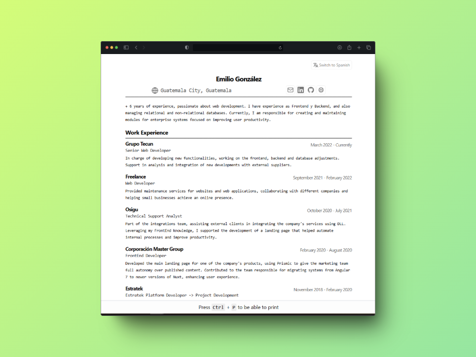

  <h1><strong>Minimalist resume formatted for web and pdf</strong></h1>
  
CV Json Schema <a href="https://jsonresume.org/schema/">jsonresume.org</a>

  
Idea Based on Bartosz's design <a href="https://github.com/BartoszJarocki/cv">Bartosz Jarocki</a>

  
Idea Based on the video created by midudev <a href="https://www.youtube.com/watch?v=Zwh92LTB-Bk">Youtube channel of Midudev</a> and repository <a href="https://github.com/midudev/minimalist-portfolio-json">Github Midudev</a>

  
I18n based on Rebeca Murillo's repository  <a href="https://github.com/rebecamurillo/astro-blog-i18n-starter">Rebeca Murillo</a> and Astro documentation <a href="https://docs.astro.build/en/guides/internationalization/">Astro i18n</a>

  

## 🛠️ Stack
- [**Astro**](https://astro.build/) - The web framework for content-driven websites
- [**Tailwind CSS**](https://tailwindcss.com/) - Rapidly build modern websites without ever leaving your HTML.

## 🚀 Features
- 🌐 Internationalization (i18n) - Support for English and Spanish.
- ⚡ Optimized performance - Responsive design optimized for mobile devices and print to PDF.

## 🔑 License
[MIT](LICENSE) - Created by [**Emilio**](https://emiliogonzalez.dev)
